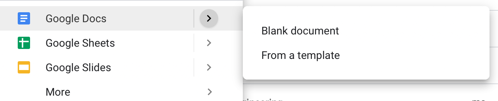

# Delivery Templates

All of our Delivery Templates exist within the Template Gallery in gDrive. To leverage a Template, when creating a new file \(either gDoc of gSheet\) select the arrow to the right of "Google Docs" or "Google Sheets" and then select "From a Template".

You will be taken to the Template Gallery page. Scroll down to the "Delivery" section, and select the template you want to leverage.

It will automatically create a formatted copy of the tempalte in whichever folder you accessed the "New" document from.

## List of Templates

### Google Sheet Templates

1. [\[TEMPLATE Team Member Name\] ADMIN Onboarding Checklist](https://drive.google.com/open?id=1MPVJ9W8TCc_0_OxeVAoePqVFSf13Qa_sWCQ1vvSFIro)
2. [\[TEMPLATE Client Name\] Agile Estimation](https://drive.google.com/open?id=1KE_EXXlL_LVyyy36aVydDrt7GR_yYV1OVKyhfE9E5js)
3. [\[TEMPLATE Client Name\] Agile Retro](https://drive.google.com/open?id=1OWssgBpdfKmrZkF7ZigryXsebuEs4d-zgGQgv5259eQ)
4. [\[TEMPLATE Client Name\] Budget Tracker](https://drive.google.com/open?id=1JDVuXN9Qzx5UKlPMIv5HEW9ImFrWTSdFfgJiEJ9FUYo)
5. [\[TEMPLATE Client Name\] Discovery & Definition](https://drive.google.com/open?id=10goJhzEyq1731JZ8EDNuf7Tn5iSF8_nFX_9dXRv06J8)
6. [\[TEMPLATE Client Name\] Status Report](https://drive.google.com/open?id=1yiIqmnGRZB42M_Xvlo6bZgZeezPtF4zQOnyXuYuK_aY)

### Google Doc Templates

1. [\[SHARED\] \[TEMPLATE Client Name\] Client Meeting Notes](https://drive.google.com/open?id=1UgwHsJflxRjhJsxrDG3GUfJ7-HyLMZ9L2CBAaYeXhnM)
2. [\[SHARED\] \[TEMPLATE Client Name\] External Kick-Off](https://drive.google.com/open?id=1AOanvRRh8V83ZIUxAWoPrNl52KiH98-gEKTRxgNcq0w)
3. [\[SHARED\] \[TEMPLATE Client Name\] Product Backlog Grooming](https://drive.google.com/open?id=1gNlpwWEoKJ01pVTISbvNk4MsWtYe_sdBE9qwgG8YCI8)
4. [\[SHARED\] \[TEMPLATE Client Name\] Sprint Planning](https://drive.google.com/open?id=1HPx83VspSnjfiMwERc99NWPCloeBCYpg7bizF38aVYc)
5. [\[SHARED\] \[TEMPLATE Client Name\] Sprint Review/Demo](https://drive.google.com/open?id=1Nd3bdcUliMeZSUH_zxHV0stvXPQb4m8kYhrx6OEWXyk)
6. [\[SHARED\] \[TEMPLATE Client Name\] Change Order \# - \[CLIENT/PROJECT NAME\]](https://docs.google.com/document/d/1dqTnlVspeEzSP_bbMFn1PtKqpgtys57ploC4qKXwouM/edit#)
7. [\[TEMPLATE Client Name\] Client Project Brief](https://drive.google.com/open?id=148bjn-9sRihk3MFERyrjFmmEVIzSRmC217G5xBMb81c)
8. [\[TEMPLATE Client Name\] Discovery Documentation](https://drive.google.com/open?id=1QXJY7gvp0Jf4RJTg1jHkZRlTOoghFgRs4Jz0PiUReuk)
9. [\[TEMPLATE Client Name\] Internal Kick-Off](https://drive.google.com/open?id=1cwyHYJngBxaTpyBQiK88b3c62nnfvlbZJvAl851ARsE)
10. [\[TEMPLATE Client Name\] Meeting Notes \[INTERNAL\]](https://drive.google.com/open?id=1-PH5TJdS9X71i450GduQScth70V0t8MrlGSf5tpQvhk)
11. [\[TEMPLATE Client Name\] Project Documentation](https://drive.google.com/open?id=1Wo7JvwIDEHEh4pSaBgj_naXAq3wqPi1DV7cte2GImW4)
12. [\[TEMPLATE Client Name\] Speed Analysis \[INTERNAL\]](https://drive.google.com/open?id=1hAgsTgrnaxZYZ6I6-QUQFJF_kmZRzAM-CTVz66_erik)
13. [\[TEMPLATE\] PM Sync Notes \[INTERNAL\]](https://drive.google.com/open?id=1_nWooFr_JZHGZYs_ldK69Ul2um2Xits5fAqpA9m8uz4)
14. [\[TEMPLATE\] PO/QA Sync Notes \[INTERNAL\]](https://drive.google.com/open?id=1uB8SDHNgfiGrtnTpY_ofiuZnsxDLC02JLmKlwRxAR2E)
15. [\[TEMPLATE\] XWP Team Bios \[INTERNAL\]](https://drive.google.com/open?id=1nfE4zdOtkddzJfqJGqMNz0_sIaviIj8HGKi4pOOzA2k)

