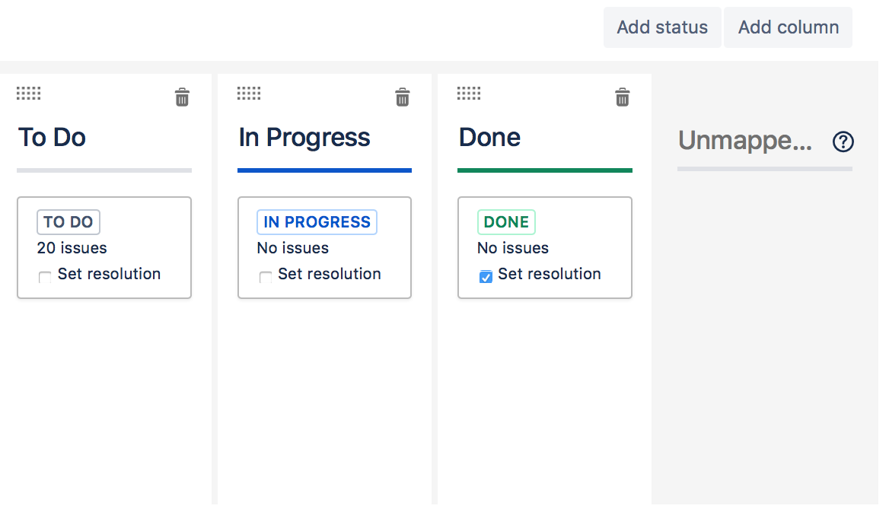
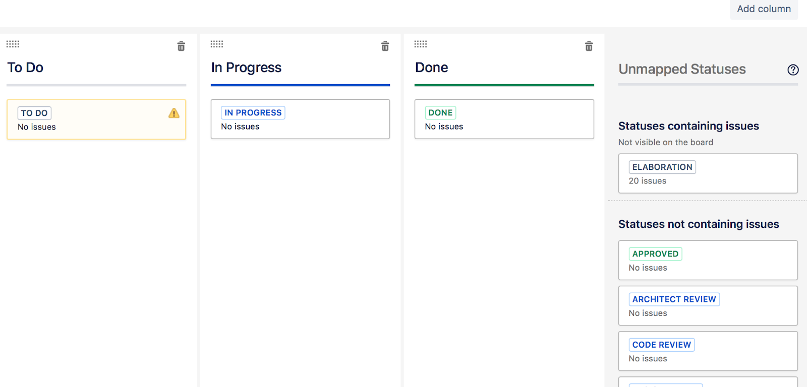
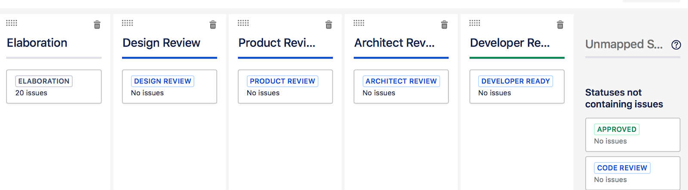
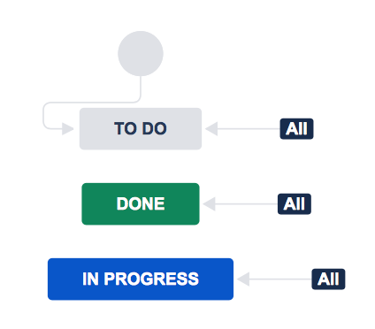
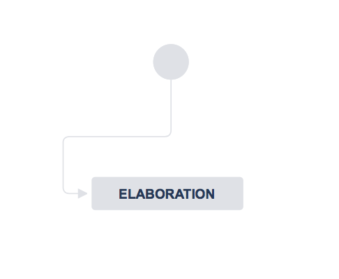
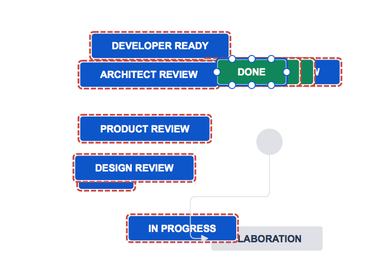
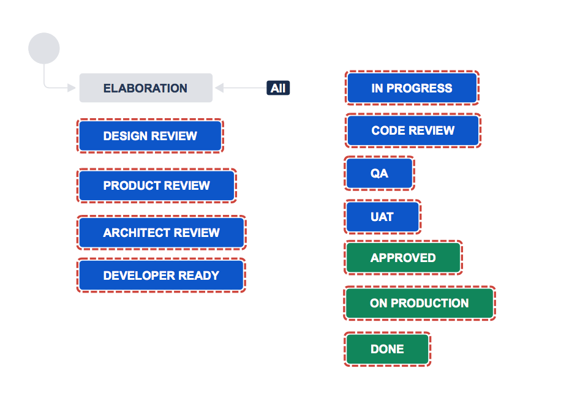

# Setup Jira

**Please note: this is not intended for Next-Gen projects. When setting up project please use “Classic Project"**

## Permissions TL;DR

You MUST use the “Default XWP Permission Scheme”. The actual default \(the permission scheme added upon initial creation\) is called “Default Software Scheme \(do **NOT** use\)” gives ALL Jira users access to your project, including Clients not related to the work.

Once you have confirmed the right Permission Scheme is being used, you can go into the “People” section for the project and add individuals/groups to the project.

Make sure when in “People” there is no group called “users”, this will also allow anyone in Jira, including other Clients, to see your project.

## Setting up a new project

All Project Managers have the ability to create new projects. Only administrators can create user accounts. If you need accounts created or any other Jira help contact People Ops

1. Click on Projects in the left sidebar
2. Select Create project in the top right of the Projects page
3. Ensure **Software Development** is selected in the left pane
   1. Depending on your project type, choose either **Scrum** or **Kanban** from within the page
4. Select **Use Template** on the next step
5. Select **Company-Managed Project**
6. Give project a name, and click Create
   * When naming a project, remember, there may be multiple projects with the same Client. Ensure you use a unique name \(example: name of the project in the SOW\)
7. In the left sidebar click on Project Settings
   * Click on Permissions
     * Select Actions from the top right corner of the Permissions page
     * Select Use a Different Scheme from the dropdown
     * Within the Scheme dropdown, select “Default XWP Permission Scheme” followed by “Associate”
   * Click on People
     * Keep the “administrators” group
     * Remove the group “users”
     * Remove the group “guest-developers”
     * Remove the group “ developers”
     * Add the Project Manager and Product Owner, and select the “Administrator” role
     * Add all other internal team members as the “Developer” role
     * As a default, use “Client Team” as the role for all Client users
       * Note: if the Client user is not in the system ask in the \#projectmanagement channel for a JIRA Site Administrator \(e.g. Arlen or Mackenzie\) to add them. In your request include the project and board and the email address and role for each person you need added.

## Customizing boards

If you are using a board with progress columns \(e.g. To Do, In Progress, Done\) to track a project, you may want to update the board to match the workflow the team is using. In order to display issues, each column must have a status mapped to it. Example: when putting a card into “In Progress” the “In Progress” status allows the card to be seen in the “In Progress” column.

**Note**: The columns are manual text entry, and therefore do not need to match the name of the step in the workflow to populate so long as they are mapped together \(as defined below\). Example: When a ticket is marked “done” it could display in a “Yahoooo” column.

### Updating the board

If you setup a SCRUM project \(your project has sprints\), select “Active Sprints” / If you setup a Kanban project \(your project does not have sprints\), select “Kanan Board”

* By Default on the screen, you will see “To Do”, “In Progress” and “Done”. 
* To update the columns select the ellipsis \(...\) at the top right
* Select “Board Settings”
* Select “Columns”
* Once “columns” has been you will see an area on the screen like this

* If there are no items in the “unmapped” area of the above screenshot, you will need to update your workflow \(see how to update your workflow in the “[Updating your Workflow](setup-jira.md#updating-your-workflow)” section\). You can begin updating the workflow by clicking the “workflow” link in the paragraph on this page.
* If there are unmapped items, which there will be if you have updated to a Workflow that does not have only “To do” In Progress” and “Done”, you will see them in the gray right column under “Unmapped Statuses”

* From here, you can click the “add column” button to add as many columns as needed.
* Selecting within the Column Header allows you to enter/change text for that column
* Using the grid icon allows you to drag columns for proper reordering
* One you have all of your columns you can drag unmapped status’ from the right to the corresponding column

* Return to the project, and you should see the accurate columns
* Important things to be aware of
  * Not all status’ need to be mapped to a column, however, if a status is not mapped to a column tickets in that status will never show on the board.
  * If you have more than one board with the same status mapped to it, tickets will show duplicates in the columns mapped to that status on both boards when a ticket is assigned that status
  * All columns and statuses are just filters to ensure tickets show when and where you want them.

### Adding a board

1. If you setup a Scrum project \(your project has sprints\), select “Active Sprints” / If you setup a Kanban project \(your project does not have sprints\), select “Kanban Board”
2. If you are adding a new board, please ensure to change the name of the existing board to be reflective of the information there, versus the default board. You can change the board name by accessing the “...” at the top of the page, going into board settings, and within the summary section changing the board name
3. When looking at the existing board, select the “...” in the top right
4. Choose “create board”
5. For ease, choose to create the same type of board you currently have \(Scrum or Kanban\)
6. Choose “Board from an existing project”
7. Name the board
8. Select create
9. To update the columns, etc. on the added board, refer to the section above \([Updating the board](setup-jira.md#updating-the-board)\)

## Updating your Workflow

You will want your workflow in Jira to match the workflow the team/client is using for the project. A workflow designates status’ that can be assigned to a ticket, and that a ticket can progress through as it works its way to complete. Workflows can be complex, or straightforward to account for all of the needs of your project. 

By default Jira uses the “ Software Simplified Workflow Scheme”:

This includes only 3 status’: “To Do”, “In Progress” and “Done”. This diagram indicates that when a ticket is created in this workflow \(represented by the gray circle\) it is put in a “to do” status. It also shows that all tickets can be transitioned to all status’. This means there are no limitations to moving a ticket around. A logical limitation would be that a “to do” ticket cannot transition to “done”.

If you need to update your workflow, here is how to do it:

* Go to the Jira Dashboard
* From the left menu select “Jira settings”
* Select “Issues”
* Select “Workflows”
* Select “Add Workflow”
* If the workflow you are creating is specific to a project, name the workflow specific to your project “Google Development Workflow”. If it is one you plan to use on multiple project’s name it accordingly. 
* Now you will be able to begin creating your workflow. By default you will see “Elaboration”, but you can remove this if you’d like:

* The gray circle indicates the entry point of creating a ticket, so whichever status’ the gray circle leads to will be the default status upon ticket creation
* Begin adding/creating the statuses you need by selecting the “Add status” button
  * There will be a lot of statuses already in the system. If one exists that matches your needs select it from the dropdown
  * If you need to add a new status, go ahead and do so, and add in the “category”, which has to be “to do” “in progress” or “done”
  * As you add statuses they will land as draggable blocks on the screen:

1. Once all statuses have been added its time to move them into a logical format, and add transitioning. You can move them around by clicking and dragging

* Now we need to set transitions, you can lock down transitions ... X status can transition to Y, or back to C. Or you can allow all statuses to transition to the status.
  * To allow all statuses to transition to the status you are updating, select the status block. A modal will appear, within the modal select the “Allow all statuses to transition to this one” checkbox
  * To add a specific transition from a status to another status, select the status block. A modal will appear, within the modal select the “Add Transition” link.
  * Choose the starting status, and ending status, and name the transition. Example: Developer Ready to In Progress, transition: begin development.
* Once you have completed adding in status and transitions then navigate to the project you wish to use this workflow for.
* When viewing the project in Jira, select “Project Settings” from the left menu
* Select “Workflows”
* Select “Add Workflow” and choose “add existing”
* Look in the list for the Workflow you just created
* Select which issue types you would like to assign to the workflow \(default should be all\)
* Once the dialogue box closes, select “Publish” at the top of the page.
  * If you have existing tickets Jira will guide you through transitioning them. Ideally, workflows are updated at the onset of a project.
  * Select Acknowledge

## Adding team members or clients to an existing project

On the Project Settings page, select “People” from the left side bar, and set things up the following way, some of it may already be there:

* Administrators: group called “administrators”, Project Manager, Product Owner
* Client Team: Add individual users or a user group if there is one for this client
* Client Admin: Key decision-maker on client’s team. Can do everything client team can + resolve, close and delete tasks, change task’s reporter and task’s sprint.
* Developers: Contributors on your team individually, no default groups
* If "users" displays, select "Remove"

## Archiving a project \(if you don’t want to delete it\)

1. Click on Project Settings in the left sidebar of the project
2. Click on Summary.
3. Under Permissions click on the hyperlinked Scheme name
4. Under Actions \(top right\) select use a different scheme
5. Select No Permissions in the dropdown and click Associate

## Did you know?

Sprints are not projects specific

Scenario:

* In project A you create sprints A1, A2 and A3
* In project B you create sprints B1, B2 and B3
* When editing a story in project A, Jira will happily let you assign it to sprint B1.

### Default Jira Permissions give all logged-in users access to all projects

When you create a new project it automatically gets assigned the "Default software scheme". This allows any user in the "users" group access to the project. That's why we created "Default XWP Permission Scheme" that you should assign to your new project ASAP.

If you can’t tag a user there’s a fix 

### Renaming a status in a workflow will rename it in EVERY project

Tempted to rename the status “In Progress” to “Magic Happening” in your workflow? This will rename the status in every workflow on every single project in Jira. If you want a unique status, create a new one; or simply rename the column heading on your board for a quick win.

### You can reduce the amount of email notifications coming from Jira

Jira allows the project admin to configure what actions trigger email notifications. This is done in Notification Schemes. It is not too granular but still can be very helpful.

Notifications can be set up based on user groups, project roles, even specific users. So if you care to know whenever a new ticket is created, you can get an email when that happens. If you want to get an email every time someone comments on any ticket, that can be arranged. If you don't want to get any emails because you have a 6th sense when someone needs you, then email notifications can be disabled altogether for you.

## Miscellaneous tips

### Prioritized Backlog vs Just Backlog

It may be overwhelming \(and un-scrum-like\) to fill in detailed definition and estimate for each story in the backlog. At the same time, having stories prioritized and defined ahead of sprint planning meeting would be very beneficial.

A middle ground is to create a bucket for stories that are defined and estimated while the rest lives in the backlog. You can do this by creating a "sprint" called Prioritized Backlog. And only drag stories in there that have enough definition and are ready to be pulled into the next sprint.

### Superfast navigating to an issue

@todo this is missing the link to the bookmarklet

Scenario:

1. Someone says "I need help with Jira ticket AT-7"
2. You click on a bookmarklet in your bookmark bar for that project and when asked for the Jira ticket number, type in 7

Voila, you land at [https://xwp-co.atlassian.net/browse/AT-7](https://xwp-co.atlassian.net/browse/AT-7)

